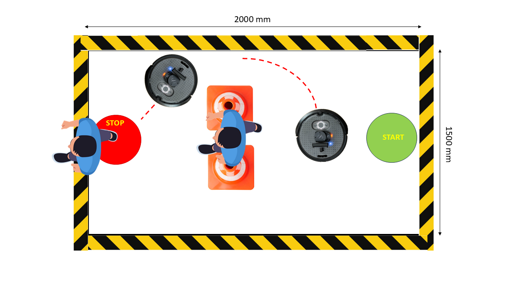

# Multipurpose Macro Load Bearing Assistive Follower Robot Project

**Team:** 07  
**Course:** RAS 598 Experimentation and Deployment of Robotic Systems, Arizona State University

## Team Members

### Rhutvik Pachghare
Pursuing a master's degree in robotics and autonomous systems, with a degree in Electrical Engineering and experience as a team lead software developer, specializing in cloud computing and multiple development languages.

### Mohammad Nasr
Robotics and autonomous systems PhD student specializing in designing Bio-inspired hearing for robotic platforms.

### Shashank Sing Deo
B.Tech in Mechanical Engineering, worked as systems and integration engineer with Evage motors designing N1 and M3 category vehicles for Indian, Middle east and European markets.

## Introduction
This project investigates how a mobile robot can effectively follow and assist a user while maintaining situational awareness through obstacle avoidance and user recognition. Specifically, we focus on developing an assistive follower robot using a TurtleBot 4 platform equipped with a depth camera and LiDAR. The system is designed to enable hands-free transportation of small items—such as groceries, shopping bags, or tools—and assist in tasks like carrying a camera for photography or videography. Our broader objective is to contribute to the development and normalization of assistive robotic technologies in everyday life.

To operate effectively in real-world environments, the robot must support key features including global and local path planning, dynamic obstacle avoidance (e.g., navigating around moving pedestrians), and user-specific tracking to differentiate its intended user from others in the environment.

While the initial project vision included more ambitious capabilities—such as allowing the robot to lead the user, full SLAM integration, and advanced navigation using a gap-finding algorithm—hardware limitations (notably issues with the depth camera and the turtlebot4_navigation package) led us to revise the project's scope. The final implementation focuses on local path planning, obstacle avoidance, and user's shoe detection as a mean for user localization. These features, along with the rationale for our design decisions, are detailed in the following sections.

## Sensor Integration

The assistive follower robot integrates both a depth camera and LiDAR to enable robust user tracking and situational awareness. The depth camera is primarily responsible for user recognition and tracking, while the LiDAR sensor is used for obstacle detection and environmental mapping. This combination allows the robot to navigate safely through dynamically changing environments.

Beyond obstacle avoidance, LiDAR can also be leveraged to maintain an optimal following distance. Once the user's direction relative to the robot is known—typically provided by the depth camera—the robot can associate this direction with a corresponding LiDAR beam and monitor its distance reading. Although this feature has not yet been implemented, it presents a promising opportunity to enhance the robot's control behavior and responsiveness in future iterations.

## Interaction

The TurtleBot 4 is equipped with a depth camera, LiDAR, and a Raspberry Pi, enabling effective sensing, interaction, and control. Due to the limited field of view of the depth camera and the computational constraints of the onboard Raspberry Pi, we adopted a lightweight user identification strategy based on shoe detection. A custom-trained model detects and localizes the user's shoes to estimate both the direction and distance of the user relative to the robot.

Our original design envisioned a hybrid navigation framework in which the LiDAR would provide 360-degree obstacle detection, assist in maintaining a safe following distance, and enable real-time gap-finding for navigation. In scenarios where no viable local path was identified through the gap-finding algorithm, the robot would fall back on a SLAM-based approach using the Nav2 stack to generate a local map and plan an alternative route. This layered architecture was intended to allow the robot to adapt intelligently to complex, dynamic environments.

However, due to persistent integration challenges with SLAM, Nav2, and the custom gap-finding algorithm, we revised our approach. The final implementation relies solely on local path planning, obstacle avoidance, and user direction input via shoe detection. In this setup, the robot receives the estimated direction of the user and initiates motion toward that direction using the gap-finding algorithm, while simultaneously maintaining environmental awareness and avoiding dynamic obstacles.

### Data collection & Image processing
To detect and localize shoes we focuse on developing a machine learning model capable of detecting shoes and estimating their position on-screen using an OAK-D camera mounted on a TurtleBot. The camera is fixed at a height of 192 mm from the ground, and its field of view has been calibrated to account for perspective distortion, including a measured offset of 180 mm between the camera’s optical center and the center of the captured image. 

Data collection was performed in a controlled indoor environment and classroom to ensure consistency, with the camera mounted on a tripod and a coordinate system marked on the floor to map image coordinates to physical positions as shown below.

To capture the variability in shoe placement, eight different images were taken at each floor coordinate. Additionally, to teach the model to infer depth, five images were captured at varying distances from a fixed origin for each shoe position. Each image in the dataset is annotated with the shoe's bounding box, its physical distance from the camera, and its relative floor coordinate. Data labeling was performed using the free and open-source software LabelMe, which allowed us to annotate each image with the shoe’s horizontal offset (x), distance from the camera (z), and orientation angle. The labeling convention we followed is illustrated in the figure below.

As distance increases, both the bounding box size and screen mapping change due to perspective scaling. The proposed machine learning pipeline includes an object detection backbone—ResNet18—to identify the shoes and estimate the user’s direction and distance.

### Shoe Detection Model: Training and Inference
To train the shoe detection and localization model, we first structured the dataset properly. The dataset directory includes a .csv annotation file, a folder containing all labeled images, and the Python training script. Each image in the dataset is labeled with normalized x-offset, z-distance from the camera, and orientation angle. A total of four values are regressed by the model.

We used a lightweight pretrained convolutional neural network—ResNet18—as the backbone for the regression task. Its final fully connected layer was modified to output four continuous values corresponding to the shoe’s location and orientation. The model was trained using PyTorch, with data augmentation (such as rotations) to improve generalization. The model was trained using the Mean Squared Error (MSE) loss function and optimized with Adam. After training, the model was saved in a .pth file for later use in real-time inference.

## Control and Autonomy

### Real-Time Inference with DepthAI and OAK-D Camera
The trained model is loaded and executed in real time using the OAK-D camera with DepthAI. The rgb_stereo launch file from the depthai_ros_driver package initializes the camera and publishes the RGB and stereo image streams to ROS 2 topics. These streams can be subscribed to for real-time image processing and pose estimation.
Our custom ROS 2 node, shoe_predictor_node.py, performs the complete inference pipeline and publishes the estimated user direction and position. This data is used by the TurtleBot to adjust its motion accordingly, enabling dynamic following behavior.

### Model Output
The trained model outputs continuous values:

- Normalized x-offset (horizontal displacement of the shoe)

- Normalized z-distance (depth from the camera)

- Orientation angle (to estimate user heading)

These values are processed to compute the user’s position relative to the robot and are published over ROS 2 for integration into the robot's control loop.

### Key Functionalities of shoe_predictor_node.py:
- Image Subscription: Subscribes to the RGBD stream published by the OAK-D.

- Model Inference: Loads the pre-trained ResNet18 model to detect and locate the user's shoes in the image.

- Preprocessing: Converts incoming ROS image messages to OpenCV format using cv_bridge, resizes and normalizes the image to match the training format.

- Prediction Processing: Uses model outputs to infer the user's relative direction, distance, and orientation.

- Publishing: Sends estimated user relative direction to robot to the /rpi_11/user_position topic.

- Error Handling: Logs issues during image conversion or inference to ensure robustness.

This architecture enables frame-by-frame estimation of the user's shoe location and orientation in real time. Thanks to the lightweight nature of the ResNet18 model and efficient inference pipeline, this system is well-suited for deployment on resource-constrained platforms like the Raspberry Pi

### Navigation and Motion Control

Initially, we introduced the use of SLAM as a secondary navigation method. In this architecture, the robot primarily relies on a reactive gap-finding algorithm for real-time obstacle avoidance. However, in situations where a passable gap cannot be identified, the robot falls back on the SLAM-generated map to make informed navigation decisions. In this setup, a SLAM node runs continuously to map the environment as the robot moves. Once the user’s heading is determined, it is sent as a goal to the Nav2 planner server. This server generates a global path based on the current map. My custom Reactive Gap Finder node, which subscribes to the /rpi_11/plan topic, receives this path, follows it, and performs local obstacle avoidance by identifying and navigating through gaps in the environment.The figures below, which provide a zoomed-in view of the rqt_graph, clearly illustrate this architecture. As shown, the SLAM Toolbox subscribes to the /rpi_11/scan topic to perform mapping and localization. Meanwhile, the FollowerGap_node subscribes to the /rpi_11/plan topic to receive the global path coordinates for local planning.

From here, we present the key challenges encountered throughout the project, the custom solutions we implemented to address them, and the lessons learned during system integration and testing. This retrospective highlights both the technical hurdles we faced—such as SLAM, conflicting control inputs, and TF management—and the strategies we adopted to overcome them, including remapping, custom planner development, and refined system architecture.

**Challenges, Custom Development, and Solutions**

- **SLAM Integration Issues:**
One of our original objectives was to use SLAM-generated maps for enhanced path planning and localization. While we successfully demonstrated navigation using maps created in a controlled lab setting (see Figure and accompanying Navigation with Map video), this success was inconsistent and difficult to reproduce reliably. The core issues stemmed from turtlebot4_navigation package.

- **Obstacle Avoidance Conflicts:**
The Reactive Gap Finder generally performed well in local navigation. However, occasional collisions with obstacles persisted, despite extensive parameter tuning. To mitigate this, we attempted to combine gap-based obstacle avoidance with Nav2’s dynamic mapping and planning features. Integration proved difficult due to command conflicts: both the Nav2 controller and our custom node were publishing velocity commands to the /cmd_vel topic simultaneously, resulting in erratic behavior and deviations from the intended path. Attempts to resolve this by modifying the nav2.yaml configuration file were unsuccessful, as demonstrated in our test video.

**Custom Development:**
To overcome dependencies on the Nav2 stack, we explored a fully custom approach by developing a lightweight A* planner. This planner receives the estimated user position and direction as a goal and generates a corresponding trajectory. However, for this approach to be fully functional, proper access to the robot’s coordinate frames (TFs) is essential.

Despite several attempts, we were unable to consistently obtain the necessary TFs (e.g., odom, base_link, map) within our custom node. The node was only able to access the map frame, and transformations between key frames were missing. As a result, although the robot could localize itself in the map frame, the lack of proper frame transformations caused it to deviate from the generated path as illustrated in our test video.

**Proposed Solutions and Workarounds**

1. Resolving "Full Queue" Errors and Dropped TF Messages
A common error we encountered involved message queues filling up and dropped TF messages. A practical solution was to remap TF topics explicitly:
/tf := /rpi_11/tf  
/tf_static := /rpi_11/tf_static

One recurring issue I encountered was related to message queues filling up and TF messages being dropped. A solution that worked for me was remapping the TF topics. Specifically:
/tf := /rpi_11/tf  
/tf_static := /rpi_11/tf_static

This remapping became necessary after I noticed an error message pop up when I closed RViz while SLAM and RViz were running together. The message highlighted improper remappings like /tf:=tf and /tf_static:=tf_static, which are ineffective.

These remappings became essential after noticing incorrect defaults like /tf:=tf, which had no effect. Since these remappings are often hardcoded into launch files, they must be edited directly and cannot be passed as standard ROS 2 arguments.

2- Editing Configuration Files
In /opt/ros/humble/share/turtlebot4_navigation/config, YAML files define parameters for SLAM, localization, and the Nav2 stack. We experimented with editing these files to disable or replace certain components—such as removing the default planner server in favor of our own. However, doing so led to system instability, likely due to additional internal dependencies that were not updated accordingly. This highlights the tight coupling between components in the Nav2 stack.

3- TFs Not Displaying with view_frames

Tools like view_frames from tf2_tools do not automatically account for namespaced TF topics. To visualize the full TF tree correctly, remapping is required at runtime:

ros2 run tf2_tools view_frames                             \
        --ros-args                                         \
        -r /tf:=/rpi_11/tf -r /tf_static:=/rpi_11/tf_static

After applying this, the TF tree was successfully generated and frames.pdf showed all expected transforms.

4- Using TFs in Custom Nodes
When using custom ROS 2 nodes that rely on TF data (e.g., for localization or planning), it is essential to launch them with the appropriate TF remappings. For example:

ros2 run my_nodes tiny_astar_planner \
  --ros-args \
  -r /tf:=/rpi_11/tf \
  -r /tf_static:=/rpi_11/tf_static

While this remapping allowed my node to receive TFs (such as the map frame), I encountered issues with incomplete transformations between frames. As Dr. Aukes recommended, a workaround is to record the TFs from RViz or explicitly publish them yourself (e.g., with a static transform publisher or a TF broadcaster node), ensuring your node has access to all required transforms.

## Graphical User Interface (GUI)
### Current Progress:
In this component of our project, we are simulating a ROS 2 NavigateToPose action server and integrate it with a PyQt5 graphical user interface (GUI) to visualize robot sensor data and navigation status. The action server acts as a dummy implementation that mimics the behavior of the standard NavigateToPose interface in ROS 2. It receives target pose goals from clients, simulates navigation by periodically publishing feedback (e.g., distance remaining), and returns a result upon completion to indicate whether the goal was successfully reached or not. Users can send goals using the ROS 2 command-line interface, specifying the desired position and orientation within the map frame. On the GUI side, we use PyQt5 to create a clean interface that displays LIDAR scan data, camera images, and the current status of the navigation process. The interface includes buttons to trigger visualizations and a status label that reflects the robot’s current state (e.g., Idle, Navigating, Completed). The GUI listens to the GoalStatusArray topic to receive real-time updates on the navigation goal, dynamically showing statuses such as Accepted, In Progress, or Aborted. In the final version, we replace the action server with the robot action server enabling us to monitor the navigation status. Loging buttons and camera will remain as tools for debugging purposes, while Lidar data display might not be needed in the final version. 

## Preparation Needs

### What do you need to know to be successful?
- Learn to calibrate and operate the hardware like camera, LiDAR, Raspberry Pi
- Machine learning tools or OpenCV for optimal image processing
- Data filtering
- Control Logic and data flow

### Which of those topics do you need to cover in class?
- Data filtering
- Control Logic and data flow

## Final Demonstration

Conditions change in any environment. How will your robot handle variability in its environment?
- Potential environmental variabilities include lighting conditions, the user’s relative direction with respect to the robot, and narrow gaps smaller than the robot’s diameter.
- Changes in lighting conditions can affect image processing and user recognition accuracy. To address this, more advanced image processing algorithms that are robust to lighting variations will be explored.
- In scenarios where the robot encounters narrow gaps that are smaller than its diameter, the robot needs predefined behavior. In our case, The robot will use SLAM and mapping as an alternative mean of motion planning.
- To maintain accurate user tracking during movement, an optimal update rate for user position data will be determined. This will allow the robot to dynamically adjust the LiDAR beam it uses for distance keeping and movement direction correction, ensuring responsive and adaptive following behavior.

## Testing & Evaluation Plan

### Scenario 1: Linear and Turning Motion
The robot follows the person in a straight line and takes turns as the person takes turns in a 2000mm x 1500mm test area divided into 500mm vertical sections.

### Scenario 2: Random Path Tracking
The robot must work autonomously and comprehend random paths traveled by the person. We plan to place start and stop markers for the target randomly in the test area with obstacles like traffic cones.

### Scenario 3: Obstacle Detection and Alternate Path
The robot may encounter obstacles in its path and must devise a new path to reach the target person.

## Impact

This project will advance assistive robotics by developing a follower robot that can safely navigate and help users in dynamic environments. It will help us learn advanced ROS2 communication, multi-sensor data fusion, and computer vision for real-time processing. We will also gain experience in dynamic path planning and obstacle avoidance. The knowledge gained will enhance our skills in robotics and autonomy. Our work can also contribute to course development by serving as an example helping future students.

## Project Advisor

**Dr. Daniel Aukes**  
Dr. Daniel Aukes is an Associate Professor and the director of the IDEAlab. His research investigates the nexus of design, manufacturing, and data-driven decision-making to develop robots that can operate in niche environments, with a focus on affordability and accessibility. IDEALab projects focus on new tools for designing robots by pairing emerging fabrication techniques and new materials with analytical and simulation-based methods for understanding the behavior of complex systems. 

## Weekly Milestones

| Week | Hardware Integration | Interface Development | Sensors | Controls & Autonomy |
|------|-----------------------|-----------------------|---------|---------------------|
| Week 7 | Set up TurtleBot 4, all team members access, configuration | N/A | Test data publishing from depth camera and LiDAR, IMU on ROS2 topics | N/A |
| Week 8 | Calibrate depth camera for user recognition; Configure LiDAR | Learn Rviz and Gazebo | Verify sensor data accuracy and publish on ROS2 topics | N/A |
| Week 9 | Ensure smooth data streaming to external PC for image processing | Use data visualization in real time with Rviz | Implement LiDAR, Depth Camera data | N/A |
| Week 10 | Finalize hardware setup and connections | Implement interaction features: mode switching, emergency stop, and distance adjustment | Implement LiDAR, Depth Camera data | Try object avoidance |
| Week 11 | N/A | User recognition modeling | Implement data acquisition and filtering for depth camera and LiDAR | Implement object avoidance |
| Week 12 | N/A | User recognition modeling | Real time image streaming and prediction | N/A |
| Week 13 | N/A | Real time user position update | Integrate sensor fusion | Implement motion control using user position feedback, and LiDAR data |
| Week 14 | N/A | N/A | Final sensor tuning and data visualization | System integration testing and debugging |
| Week 15 | Test Hardware in Demo Room | Test interaction features in Demo Room | Validate sensor accuracy and reliability | Final Test control logic and decision-making in dynamic environments |
| Week 16 | Demo | Demo | Demo | Demo |
